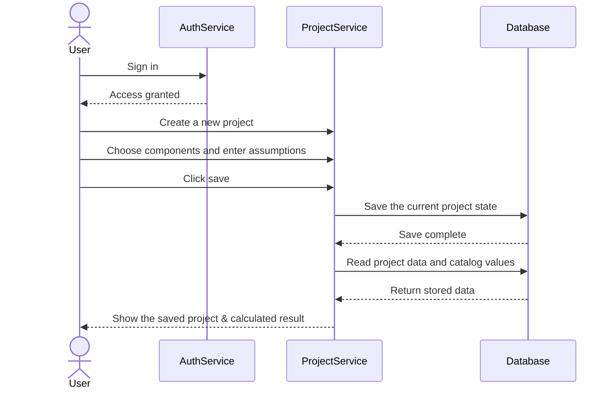
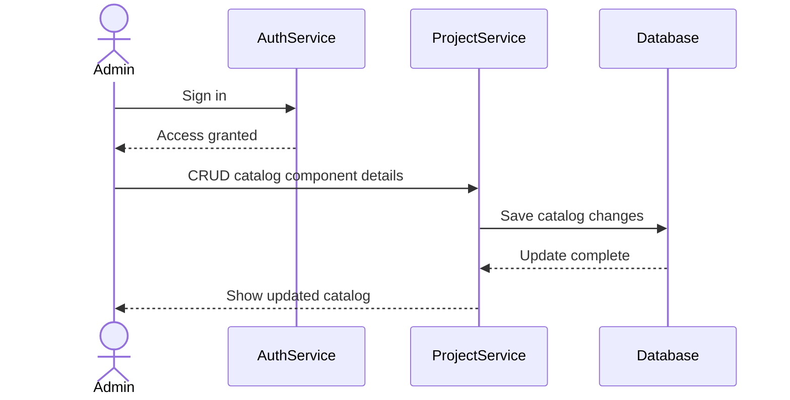

# Sequence Diagrams — Resource Sizing Calculator

This document shows the main user-facing flows in a simple way.

## 1. Project setup, calculate, and save

## 2. Admin updates the catalog

## Notes

- Calculate happens on demand and does not create stored history.
- Save stores the current project state.
- The selected component set is locked when the project is created.
- Admin catalog changes affect future calculations only.
